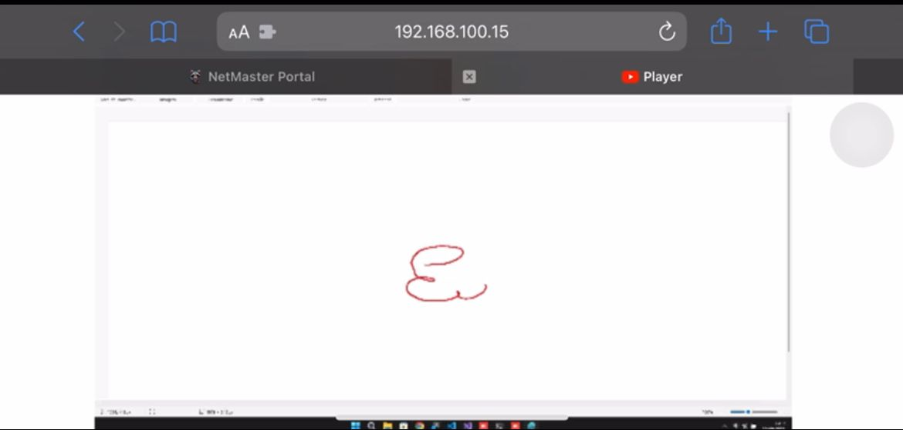

  

# Screen Streaming Server :computer: :tv:

> Um servidor de streaming de tela usando WebSocket em C#.

Este projeto implementa um servidor de streaming de tela que captura a tela do computador e envia as imagens em tempo real para um cliente através de uma conexão WebSocket.

## Tecnologias utilizadas

- C#
- .NET Framework
- System.Drawing
- WebSocketSharp

## Funcionalidades

- Streaming de tela em tempo real para um cliente WebSocket.
- Compressão de imagens usando codificação JPEG.
- Controle de início e parada do streaming através de abertura e fechamento da conexão WebSocket.

## Como usar

1. Clone este repositório: `git clone https://github.com/Higor-Matos/screen-streaming-server.git`
2. Abra o projeto em sua IDE preferida.
3. Compile e execute o projeto.
4. Abra um cliente WebSocket e conecte-se ao servidor usando o caminho `/screen`.
5. Desfrute do streaming de tela em tempo real!

## Página de Streaming Pronta

Se você deseja visualizar o streaming de tela em uma página web, confira o repositório [videoplayer](https://github.com/Higor-Matos/videoplayer). Ele fornece uma página de streaming pronta para receber o WebSocket do servidor e exibir o vídeo em tempo real.

## 🧪 Qualidade de Software

A fim de garantir a qualidade do software, o projeto Net Master Frontend utilizou a ferramenta Sonar. O Sonar é uma plataforma de análise estática de código que realiza verificações automatizadas para identificar problemas de qualidade, como vulnerabilidades, bugs, dívidas técnicas e violações de boas práticas de programação.

Durante o desenvolvimento, foram realizadas análises regulares com o Sonar para garantir a conformidade com os padrões de qualidade estabelecidos. As análises do Sonar forneceram insights valiosos sobre a saúde do código, permitindo a identificação de áreas de melhoria e a adoção de práticas recomendadas para o desenvolvimento de software.

## 🤝 Contribuição

Contribuições são bem-vindas! Sinta-se à vontade para abrir um "issue" ou enviar um "pull request" com melhorias, correções de bugs ou novos recursos. 🎉

## 🎙️ Entrevista sobre o projeto

Confira uma entrevista sobre este projeto no YouTube: [Entrevista - Expotech](https://www.youtube.com/watch?v=dFQMuRxyf1c)

## Observação sobre o Docker

Este projeto não foi dockerizado, pois exige uma interface gráfica para capturar e transmitir a tela. O Docker é uma plataforma de contêineres que é mais adequada para aplicativos baseados em servidor sem interface gráfica. Portanto, para executar este projeto, recomenda-se executá-lo diretamente em um ambiente local em vez de contêinerizar com o Docker.
